# Browser developer tools

- [What are browser developer tools](#what-are-browser-developer-tools)
- [Open the developer tools](#open-the-developer-tools)
- [The `Network` tab](#the-network-tab)
  - [Open the `Network` tab](#open-the-network-tab)
- [Inspect a request](#inspect-a-request)
  - [Select the request](#select-the-request)
  - [Inspect the request headers](#inspect-the-request-headers)
  - [Inspect the request payload](#inspect-the-request-payload)
  - [Inspect the response](#inspect-the-response)
- [Copy the request information](#copy-the-request-information)
  - [Copy the request as `fetch` code](#copy-the-request-as-fetch-code)
  - [Copy the response](#copy-the-response)

## What are browser developer tools

Docs:

- [`Chrome DevTools`](https://developer.chrome.com/docs/devtools/overview)
- [`Firefox DevTools`](https://developer.mozilla.org/en-US/docs/Learn_web_development/Howto/Tools_and_setup/What_are_browser_developer_tools)
- [`Safari Web Inspector`](https://developer.apple.com/documentation/safari-developer-tools/web-inspector)

## Open the developer tools

See:

- [How to open the devtools in your browser](https://developer.mozilla.org/en-US/docs/Learn_web_development/Howto/Tools_and_setup/What_are_browser_developer_tools#how_to_open_the_devtools_in_your_browser).
- [How To Use The Safari Developer Tools](https://www.debugbear.com/blog/safari-developer-tools)

## The `Network` tab

Docs:

- [`Chrome` - Inspect network activity](https://developer.chrome.com/docs/devtools/network)
- [`Firefox` - Network Monitor](https://firefox-source-docs.mozilla.org/devtools-user/network_monitor/)
- [`Safari` - Network Tab](https://webkit.org/web-inspector/network-tab/)

### Open the `Network` tab

1. [Open the developer tools](#open-the-developer-tools).
2. Click `Network`.

    - `Chrome`

      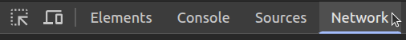</img>

    - `Firefox`

      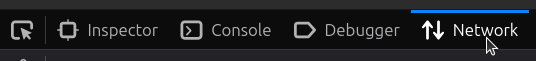</img>

    - `Safari`

      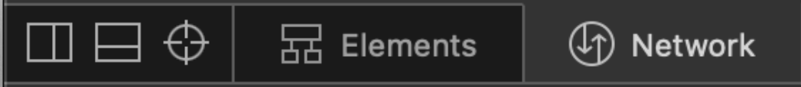</img>

## Inspect a request

> [!NOTE]
> See [`HTTP` request](./http.md#http-request).

Complete these steps:

1. [Open the `Network` tab](#open-the-network-tab) in your browser to track requests.
2. Make a request in your browser, e.g., using the `Swagger UI`.
3. In the `Network` tab, [select the request](#select-the-request).
4. [Inspect the request headers](#inspect-the-request-headers).
5. [Inspect the request payload](#inspect-the-request-payload).
6. [Inspect the response](#inspect-the-response).

### Select the request

> [!NOTE]
> See [`HTTP` request](./http.md#http-request).

1. Click the request row:

    - `Chrome`

      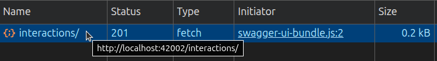</img>

    - `Firefox`

      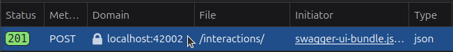</img>

    <!-- TODO safari -->

### Inspect the request headers

> [!NOTE]
> See [`HTTP` request headers](./http.md#http-request-header).

- `Chrome`: Click `Headers`.

  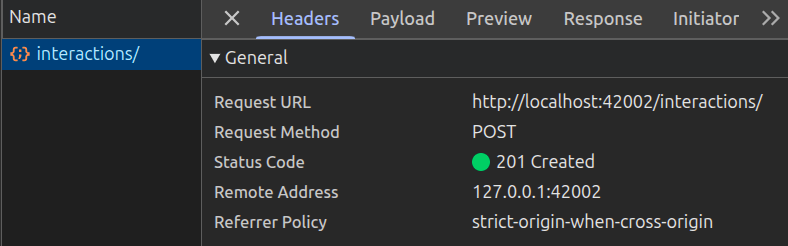</img>

- `Firefox`: Click `Headers`.

  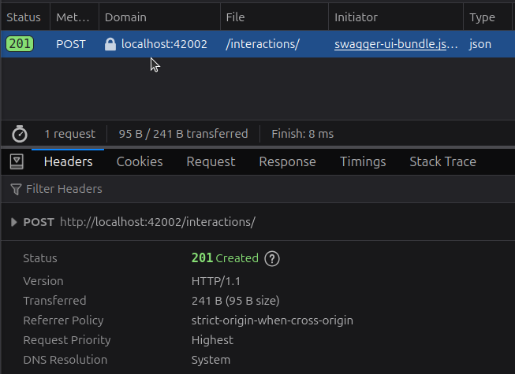</img>

### Inspect the request payload

> [!NOTE]
> See [`HTTP` request payload](./http.md#http-request-payload).

- `Chrome`: Click `Payload`.
  
  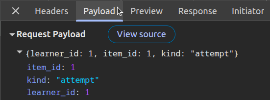</img>
  
- `Firefox`: Click `Request`.
  
  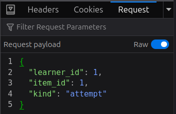</img>

<!-- TODO safari -->

### Inspect the response

> [!NOTE]
> See [`HTTP` response](./http.md#http-response).

- `Chrome`: Click `Response`.
  
  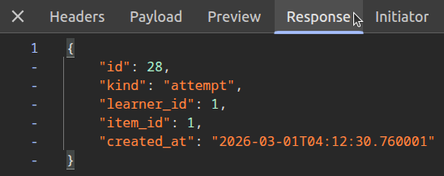</img>
  
- `Firefox`: Click `Request`.
  
  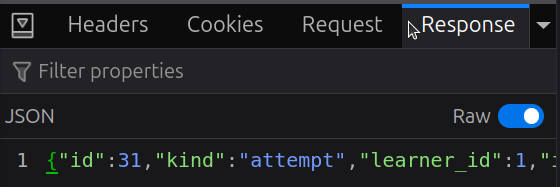</img>

<!-- TODO safari -->

## Copy the request information

You can:

- [Copy the request as `fetch` code](#copy-the-request-as-fetch-code)
- [Copy the response](#copy-the-response)

### Copy the request as `fetch` code

> [!NOTE]
> The code is written in [`JavaScript`](./programming-language.md#javascript).

1. [Select the request](#select-the-request).
2. Right-click the request.
3. Copy the request to clipboard as `fetch` code:

    - `Chrome`:

      1. Click `Copy`.
      2. Click `Copy as fetch`.

    - `Firefox`:

      1. Click `Copy Value`.
      2. Click `Copy as Fetch`.

    - `Safari`

      1. Click `Copy`.
      2. Click `Copy as Fetch`.

### Copy the response

1. [Select the request](#select-the-request).
2. Right-click the request.
3. Copy the response to clipboard:

    - `Chrome`:

      1. Click `Copy`.
      2. Click `Copy response`.

    - `Firefox`:

      1. Click `Copy Value`.
      2. Click `Copy Response`.

    - `Safari`

      1. Click `Copy`.
      2. Click `Copy Response`.
